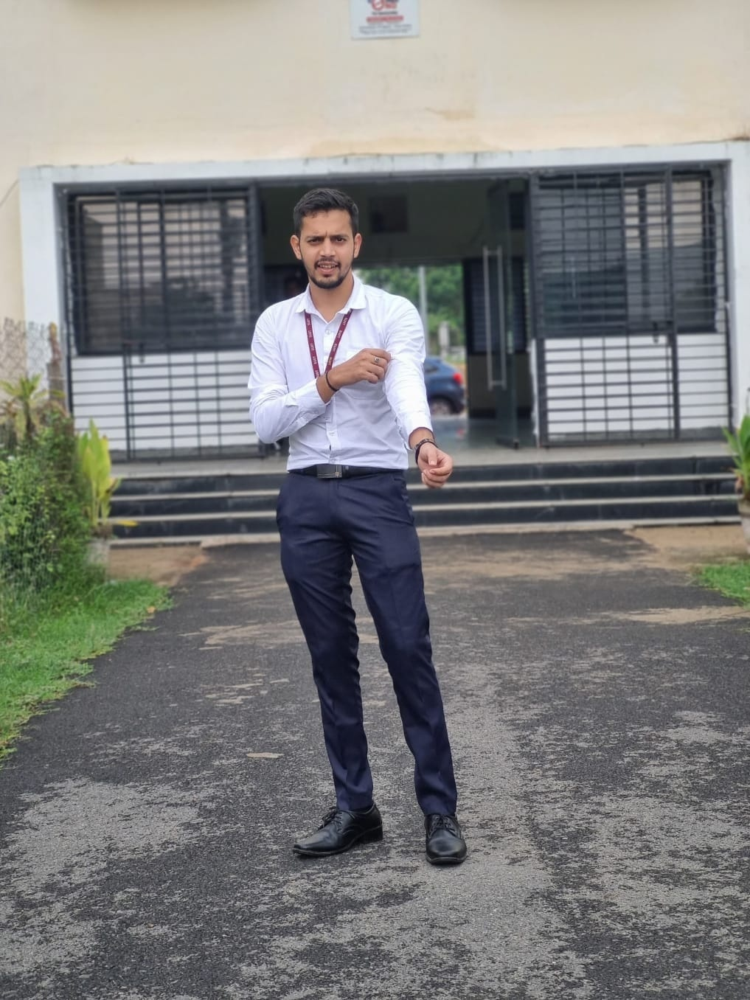

# 📷 Image Read, Write & Display using OpenCV

## 📖 Overview

This project demonstrates the fundamental image processing operations in **OpenCV** using Python. It covers how to read an image from disk, display it in a window, and save it to a new file. These are the basic building blocks for most computer vision applications.

---

## 🎯 Objectives

* Read an image using OpenCV
* Display the image in a window
* Save the image to a new location
* Understand basic image input/output operations

---

## 🛠️ Technologies Used

* Python 3.x
* OpenCV (`cv2`)
* NumPy

---

## 📂 Project Structure

```text
01_image_read_write_display/
│
├── image_operations.py
├── sample.jpg
├── output.jpg
└── README.md
```

---

## 📋 Prerequisites

Install the required library before running the program.

```bash
pip install opencv-python numpy
```

---

## ▶️ How to Run

1. Clone the repository.

```bash
git clone https://github.com/<your-username>/opencv-computer-vision-projects.git
```

2. Navigate to the project folder.

```bash
cd opencv-computer-vision-projects/01_image_read_write_display
```

3. Run the Python script.

```bash
python image_operations.py
```

---

## 📌 Program Workflow

```text
Read Image
      │
      ▼
Display Image
      │
      ▼
Save Image
      │
      ▼
Close Window
```

---

## 📸 Sample Input

Place your input image in this folder.

```text
input.jpg
```

---

## 📸 Output

After running the program, a new image will be saved as:

```text
output.jpg
```

---

## 📷 Screenshots

### Input Image


---

### Output Image



---

## 📚 OpenCV Functions Used

| Function                  | Description                    |
| ------------------------- | ------------------------------ |
| `cv2.imread()`            | Reads an image from disk       |
| `cv2.imshow()`            | Displays an image in a window  |
| `cv2.imwrite()`           | Saves an image to disk         |
| `cv2.waitKey()`           | Waits for a keyboard key press |
| `cv2.destroyAllWindows()` | Closes all OpenCV windows      |

---

## 💡 Learning Outcomes

After completing this project, you will understand:

* Reading images using OpenCV
* Displaying images in a GUI window
* Saving processed images
* Basic image input/output workflow
* Fundamental OpenCV functions

---

## 🚀 Future Improvements

* Resize images
* Convert images to grayscale
* Rotate and flip images
* Crop images
* Apply image filters
* Draw shapes and text
* Image color space conversion

---

## 👨‍💻 Author

**Manas Ranjan Meher**

* GitHub: https://github.com/manasranjanmeher99
* LinkedIn: https://www.linkedin.com/in/manas-ranjan-meher-606335253/

---

⭐ If you found this project helpful, consider giving the repository a star!
