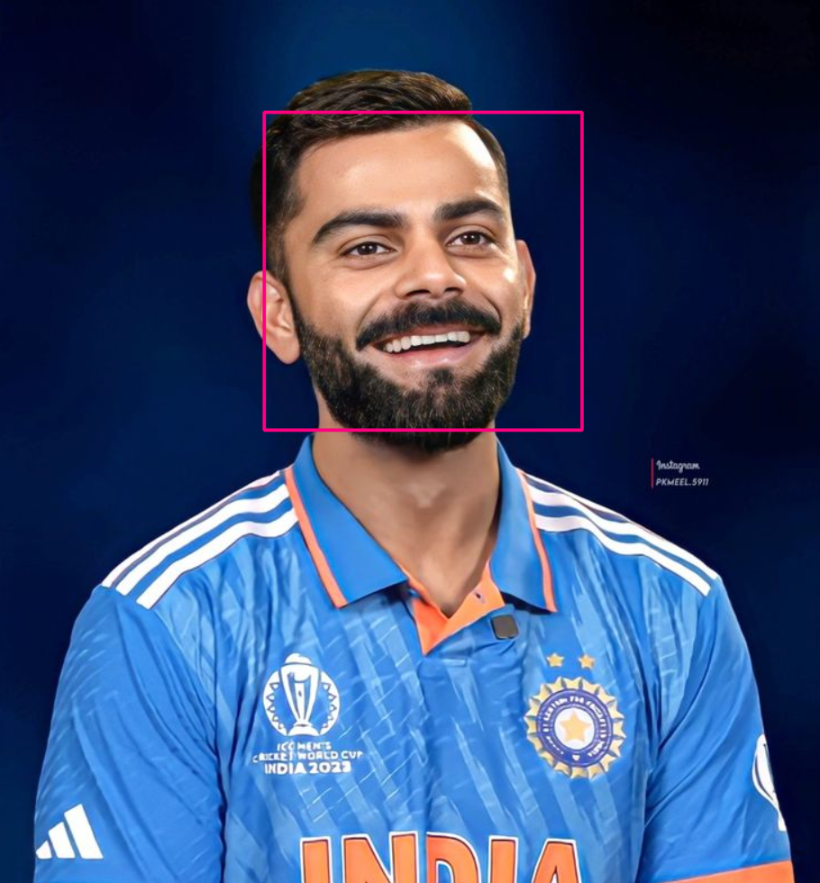

# 😀 Face Detection using OpenCV Haar Cascade

## 📖 Overview

This project demonstrates **Face Detection** using **OpenCV** and the **Haar Cascade Classifier**. The program detects one or more human faces in an input image and draws bounding boxes around each detected face.

Haar Cascade is one of OpenCV's classical object detection techniques and is widely used for learning the fundamentals of computer vision.

---

## 🎯 Objectives

* Load an image using OpenCV
* Convert the image to grayscale
* Detect human faces using Haar Cascade
* Draw bounding boxes around detected faces
* Display the detection result

---

## 🛠️ Technologies Used

* Python 3.x
* OpenCV
* NumPy
* Haar Cascade Classifier

---

## 📂 Project Structure

```text
02_face_detection/
│
├── face_detection.py
├── sample_face.jpg
├── output_face.jpg
├── README.md
│
└── ../cascade/
    └── haarcascade_frontalface_default.xml
```

---

## 📁 Haar Cascade File

This project uses the following pretrained Haar Cascade classifier:

```text
cascade/
└── haarcascade_frontalface_default.xml
```

This XML file is required for detecting frontal human faces.

---

## 📋 Prerequisites

Install the required libraries:

```bash
pip install opencv-python numpy
```

---

## ▶️ How to Run

### Step 1

Clone the repository.

```bash
git clone https://github.com/<your-username>/opencv-computer-vision-projects.git
```

### Step 2

Navigate to the project.

```bash
cd opencv-computer-vision-projects/02_face_detection
```

### Step 3

Run the program.

```bash
python face_detection.py
```

---

## 📌 Program Workflow

```text
Read Image
      │
      ▼
Convert to Grayscale
      │
      ▼
Load Haar Cascade
      │
      ▼
Detect Faces
      │
      ▼
Draw Bounding Boxes
      │
      ▼
Display Output Image
```

---

## 📚 Face Detection Algorithm

The program performs the following steps:

1. Load the input image.
2. Convert the image to grayscale.
3. Load the Haar Cascade XML classifier.
4. Detect all frontal faces.
5. Draw rectangles around each detected face.
6. Display the final output.

---

## 📷 Sample Input


---

## 📷 Detection Result




---

## 📚 OpenCV Functions Used

| Function                  | Description                       |
| ------------------------- | --------------------------------- |
| `cv2.imread()`            | Reads an image                    |
| `cv2.cvtColor()`          | Converts image to grayscale       |
| `CascadeClassifier()`     | Loads Haar Cascade XML classifier |
| `detectMultiScale()`      | Detects faces in the image        |
| `cv2.rectangle()`         | Draws bounding boxes              |
| `cv2.imshow()`            | Displays the output image         |
| `cv2.waitKey()`           | Waits for a key press             |
| `cv2.destroyAllWindows()` | Closes all windows                |

---

## ⚙️ Haar Cascade Parameters

```python
faces = face_classifier.detectMultiScale(gray, 1.3, 5)
```

| Parameter | Description                                       |
| --------- | ------------------------------------------------- |
| `gray`    | Grayscale input image                             |
| `1.3`     | Scale factor for image pyramid                    |
| `5`       | Minimum number of neighboring detections required |

---

## 📌 Expected Output

If one or more faces are detected:

* ✅ Bounding boxes are drawn around every detected face.
* ✅ The output image is displayed.

If no face is detected:

```text
No Face Found
```

---

## 📂 Files Included

| File                                          | Description                             |
| --------------------------------------------- | --------------------------------------- |
| `face_detection.py`                           | Python implementation of face detection |
| `input.jpg`                                   | Sample input image                      |
| `output.jpg`                                  | Detection result                        |
| `README.md`                                   | Project documentation                   |
| `cascade/haarcascade_frontalface_default.xml` | Pretrained Haar Cascade model           |

---

## 🎓 Learning Outcomes

After completing this project, you will understand:

* Image loading with OpenCV
* Grayscale image conversion
* Haar Cascade classifiers
* Face detection
* Object localization using bounding boxes
* Basic computer vision workflow

---

## 🚀 Future Improvements

* Real-time webcam face detection
* Multiple face tracking
* Eye detection
* Smile detection
* Face recognition using LBPH
* Deep learning face detection (DNN)
* YOLO face detection
* Face attendance system

---

## 👨‍💻 Author

**Manas Ranjan Meher**

* **GitHub:** https://github.com/manasranjanmeher99
* **LinkedIn:** https://www.linkedin.com/in/manas-ranjan-meher-606335253/

---

⭐ If you found this project useful, consider giving the repository a **Star**!
