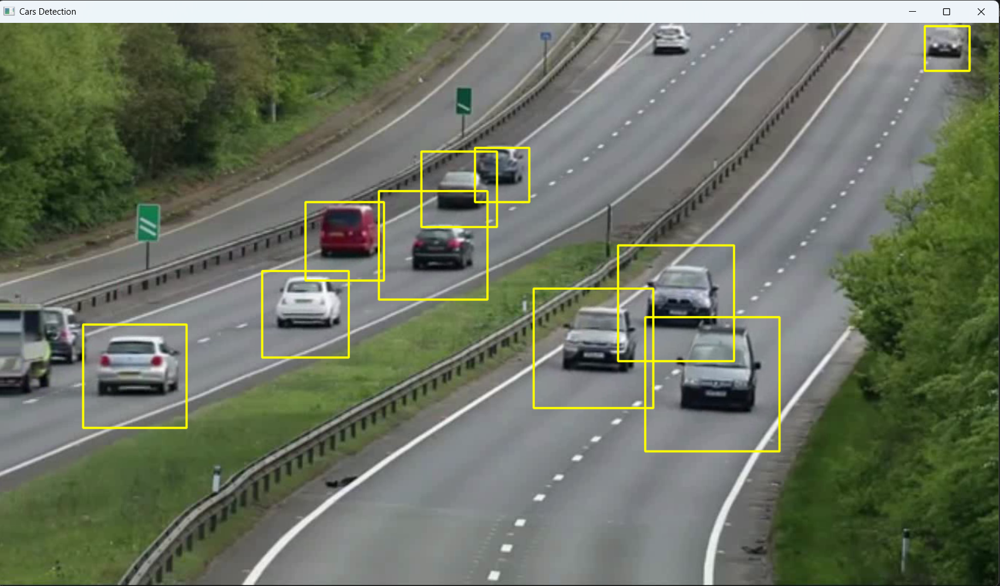

# 🚗 Car Detection using OpenCV Haar Cascade

## 📖 Overview

This project demonstrates **Car Detection** in videos using **OpenCV** and a **Haar Cascade Classifier**. The application processes each frame of a video, detects cars, and draws bounding boxes around the detected vehicles in real time.

This project is a practical introduction to vehicle detection and classical computer vision techniques using OpenCV.

---

## 🎯 Objectives

* Read a video using OpenCV
* Detect cars using a Haar Cascade classifier
* Draw bounding boxes around detected vehicles
* Display detection results frame by frame
* Understand basic object detection in videos

---

## 🛠️ Technologies Used

* Python 3.x
* OpenCV
* NumPy
* Haar Cascade Classifier

---

## 📂 Project Structure

```text
05_car_detection/
│
├── car detection.py
├── sample_video.mp4
├── README.md
├── screenshots/
    └── car_detection_output.png
└── cascade/
    └── haarcascade_car.xml
```

---

## 📁 Haar Cascade File

This project uses the following pretrained Haar Cascade classifier:

```text
cascade/
└── haarcascade_car.xml
```

The XML file contains the trained Haar Cascade model used to detect vehicles in video frames.

---

## 📋 Prerequisites

Install the required libraries before running the project.

```bash
pip install opencv-python numpy
```

---

## ▶️ How to Run

### 1. Clone the repository

```bash
git clone https://github.com/<your-username>/opencv-computer-vision-projects.git
```

### 2. Navigate to the project directory

```bash
cd opencv-computer-vision-projects/03_car_detection
```

### 3. Run the program

```bash
python car detection.py
```

---

## 📌 Program Workflow

```text
Load Haar Cascade
        │
        ▼
Open Video File
        │
        ▼
Read Video Frame
        │
        ▼
Convert Frame to Grayscale
        │
        ▼
Detect Cars
        │
        ▼
Draw Bounding Boxes
        │
        ▼
Display Video
        │
        ▼
Repeat Until Video Ends
```

---

## 📚 How It Works

The program performs the following steps:

1. Load the Haar Cascade classifier (`cars.xml`).
2. Open the input video.
3. Read each video frame.
4. Convert the frame to grayscale.
5. Detect cars using `detectMultiScale()`.
6. Draw rectangles around detected vehicles.
7. Display the processed video.
8. Exit when the video finishes or the user presses **Q**.

---

## 📹 Sample Video

Place your test video inside this folder.

```text
sample_video.mp4
```

---

## 📷 Sample Output

After running the program, each detected vehicle will be highlighted with a bounding box.

Example:

```text
+----------------------+
|        CAR           |
+----------------------+
```




---

## 📚 OpenCV Functions Used

| Function                  | Description                     |
| ------------------------- | ------------------------------- |
| `cv2.VideoCapture()`      | Opens the video file            |
| `read()`                  | Reads each frame from the video |
| `cv2.cvtColor()`          | Converts the frame to grayscale |
| `CascadeClassifier()`     | Loads the Haar Cascade model    |
| `detectMultiScale()`      | Detects vehicles                |
| `cv2.rectangle()`         | Draws bounding boxes            |
| `cv2.imshow()`            | Displays processed frames       |
| `cv2.waitKey()`           | Waits for keyboard input        |
| `release()`               | Releases the video capture      |
| `cv2.destroyAllWindows()` | Closes all OpenCV windows       |

---

## ⚙️ Detection Parameters

Example:

```python
cars = car_classifier.detectMultiScale(gray, 1.1, 3)
```

| Parameter | Description                    |
| --------- | ------------------------------ |
| `gray`    | Grayscale video frame          |
| `1.1`     | Scale factor                   |
| `3`       | Minimum neighboring detections |

---

## 📂 Files Included

| File               | Description             |
| ------------------ | ----------------------- |
| `car_detection.py` | Main Python program     |
| `sample_video.mp4` | Input test video        |
| `cars.xml`         | Haar Cascade classifier |
| `README.md`        | Project documentation   |

---

## 🎓 Learning Outcomes

After completing this project, you will understand:

* Video processing using OpenCV
* Reading frames from a video
* Vehicle detection using Haar Cascades
* Real-time object detection
* Drawing bounding boxes
* Basic traffic monitoring concepts

---

## 🚀 Future Improvements

* Vehicle counting system
* Speed estimation
* Traffic density analysis
* Lane detection
* YOLO-based vehicle detection
* Number plate detection
* Vehicle tracking using Deep SORT
* Real-time webcam vehicle detection

---

## 👨‍💻 Author

**Manas Ranjan Meher**

* **GitHub:** https://github.com/manasranjanmeher99
* **LinkedIn:** https://www.linkedin.com/in/manas-ranjan-meher-606335253/

---

⭐ If you found this project helpful, consider giving the repository a **Star**!
