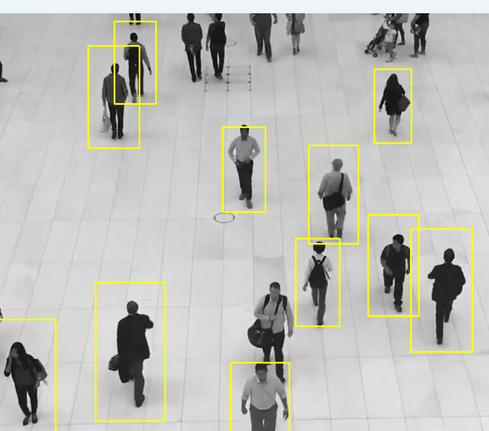

# 🚶 Full Body Detection using OpenCV Haar Cascade

## 📖 Overview

This project demonstrates **Full Body Detection** using **OpenCV** and the **Haar Cascade Classifier**. The application detects human bodies in a video by processing each frame and drawing bounding boxes around detected persons.

This project introduces classical human detection techniques and serves as a foundation for surveillance systems, people counting, and security applications.

---

## 🎯 Objectives

* Read a video using OpenCV
* Detect full human bodies using a Haar Cascade classifier
* Draw bounding boxes around detected people
* Display detection results in real time
* Learn the fundamentals of human detection in computer vision

---

## 🛠️ Technologies Used

* Python 3.x
* OpenCV
* NumPy
* Haar Cascade Classifier

---

## 📂 Project Structure

```text
04_full_body_detection/
│
├── full_body_detection.py
├── sample_video.mp4
├── README.md
├── screenshot/
│    └── full_body_detection_output.png
└── cascade/
    └── haarcascade_fullbody.xml
```

---

## 📁 Haar Cascade File

This project uses the following pretrained Haar Cascade classifier:

```text
cascade/
└── haarcascade_fullbody.xml
```

The XML file contains the pretrained model used for detecting the full body of people in images and video streams.

---

## 📋 Prerequisites

Install the required libraries before running the project.

```bash
pip install opencv-python numpy
```

---

## ▶️ How to Run

### Step 1: Clone the Repository

```bash
git clone https://github.com/manasranjanmeher99/opencv-computer-vision-projects.git
```

### Step 2: Navigate to the Project Folder

```bash
cd opencv-computer-vision-projects/04_full_body_detection
```

### Step 3: Run the Program

```bash
python full_body_detection.py
```

---

## 📌 Program Workflow

```text
Load Haar Cascade Classifier
            │
            ▼
Open Video File
            │
            ▼
Read Video Frame
            │
            ▼
Convert Frame to Grayscale
            │
            ▼
Detect Human Bodies
            │
            ▼
Draw Bounding Boxes
            │
            ▼
Display Output Video
            │
            ▼
Repeat Until Video Ends
```

---

## 📚 How It Works

The program follows these steps:

1. Load the Haar Cascade classifier (`haarcascade_fullbody.xml`).
2. Open the input video using OpenCV.
3. Read frames continuously.
4. Convert each frame to grayscale.
5. Detect full human bodies using `detectMultiScale()`.
6. Draw rectangles around detected persons.
7. Display the processed video.
8. Exit when the video ends or the user presses **Q**.

---

## 📹 Sample Video

Place the input video in the project folder.

```text
sample_video.mp4
```

---

## 📷 Sample Output

The detected human bodies will be highlighted with bounding boxes.

Example:

```text
+-------------------------+
|                         |
|        PERSON           |
|                         |
+-------------------------+
```



---

## 📚 OpenCV Functions Used

| Function                  | Description                   |
| ------------------------- | ----------------------------- |
| `cv2.VideoCapture()`      | Opens the video               |
| `read()`                  | Reads each frame              |
| `cv2.cvtColor()`          | Converts frame to grayscale   |
| `CascadeClassifier()`     | Loads Haar Cascade classifier |
| `detectMultiScale()`      | Detects human bodies          |
| `cv2.rectangle()`         | Draws bounding boxes          |
| `cv2.imshow()`            | Displays processed video      |
| `cv2.waitKey()`           | Waits for keyboard input      |
| `release()`               | Releases video resources      |
| `cv2.destroyAllWindows()` | Closes all OpenCV windows     |

---

## ⚙️ Detection Parameters

Example:

```python
bodies = body_classifier.detectMultiScale(gray, 1.1, 3)
```

| Parameter | Description                    |
| --------- | ------------------------------ |
| `gray`    | Grayscale frame                |
| `1.1`     | Scale factor                   |
| `3`       | Minimum neighboring detections |

---

## 📂 Files Included

| File                            | Description             |
| --------------------------------| ----------------------- |
| `full_body_detection.py`        | Main Python program     |
| `sample_video.mp4`              | Sample input video      |
| `haarcascade_fullbody.xml`      | Haar Cascade classifier |
| `README.md`                     | Project documentation   |
| `full_body_detection_output.png`| Project screenshot      |

---

## 🎓 Learning Outcomes

After completing this project, you will understand:

* Video processing using OpenCV
* Human body detection with Haar Cascades
* Real-time object detection
* Frame-by-frame image processing
* Bounding box visualization
* Classical computer vision techniques

---

## 🚀 Future Improvements

* Pedestrian tracking
* People counting system
* Social distancing monitoring
* Human activity recognition
* YOLO-based person detection
* Deep SORT tracking
* Pose estimation using MediaPipe
* Real-time webcam full body detection

---

## 👨‍💻 Author

**Manas Ranjan Meher**

* **GitHub:** https://github.com/manasranjanmeher99
* **LinkedIn:** https://www.linkedin.com/in/manas-ranjan-meher-606335253/

---

## ⭐ Support

If you found this project helpful, consider giving the repository a **⭐ Star** on GitHub. Your support is appreciated!
